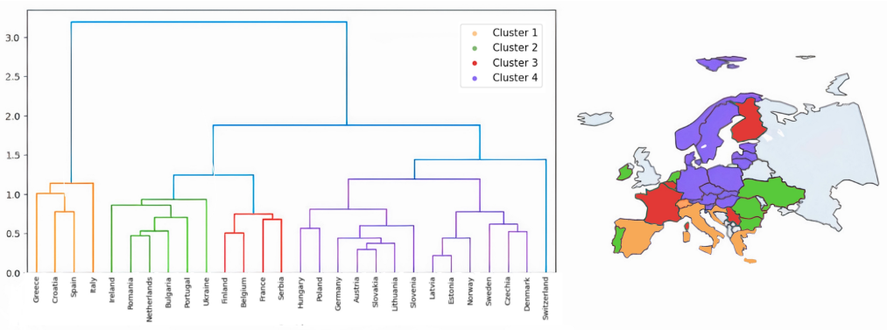

# AI Researcher

#### Technical Skills
 - Languages: C/C++, Java, Python, SQL, Bash
 - Tools: Docker, Kubernetes, Git/Github

## Education

 #center-align multiline bullet text
- Ph.D. Student, Electrical and Computer Engineering | National Tecnical University of Athens (_2023 - present_)
- M.Sc.	Electrical & Computer Engineering | University of Thessaly (_2022 - 2023_)
- B.Sc. Electrical & Computer Engineering | University of Thessaly (_2017 - 2023_)

## Work Experience
**Data Scientist @ Decision Support Systems Lab EPU (_April 2023 - Present_)**
- Assistance in academic obligations regarding undergraduate courses 

## Projects
#### Transfer Learning for Day-Ahead Load Forecasting: A Case Study on European National Electricity Demand Time Series
[Publication](https://www.mdpi.com/2227-7390/12/1/19)

We investigate the performance of a special case of STLF, namely transfer learning (TL), by considering a set of 27 time series that represent the national day-ahead electricity demand of indicative European countries. We employ a feed-forward NN model using Pytorch Lightning and perform a clustering analysis to identify similar patterns among the load series and enhance TL. In this context, two different TL approaches, with and without the clustering step, are compiled and compared against each other as well as a typical NN training setup. Our results demonstrate that TL can outperform the conventional approach, especially when clustering techniques are considered.

#### AI4EF @ Enershare
[Publication](https://epu-ntua.github.io/enershare-ai4ef/)

The aim of the service is to provide a solid methodological framework for assessing renovation actions in residential buildings. This service consists of two ML models for implementing two different tasks related to the domain of building retrofitting and energy autonomy in the residential scale. The first model is tailored for assessing specific actions in building level, while the second model aims at assessing the potential of installing rooftop solar panels in residential buildings. A backend is implemented with a combination of fastAPI/postgREST, employing RESTful APIs to establish communication between models and frontend/database respectively. 

## Publications
1. Tzortzis AM, Pelekis S, Spiliotis E, Karakolis E, Mouzakitis S, Psarras J, Askounis D. Transfer Learning for Day-Ahead Load Forecasting: A Case Study on European National Electricity Demand Time Series. Mathematics. 2024; 12(1):19. https://doi.org/10.3390/math12010019
